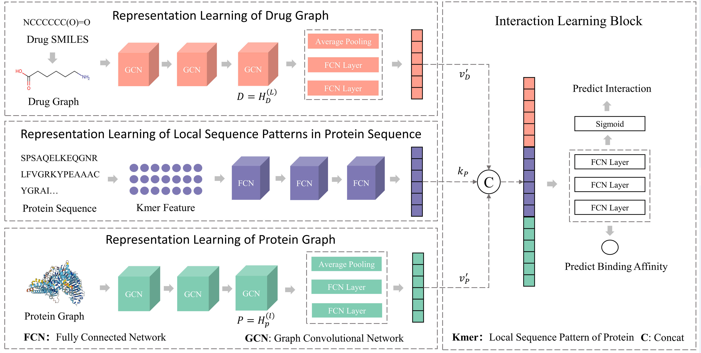

# GraphkmerDTA: Integrating Local Sequence Patterns and Topological Information for Drug-Target Binding Affinity Prediction and Applications in Multi-target Anti-Alzheimer's Drug Discovery

[]()
[]()
[]()
[]()
[]()
[]()
[]()
[]()

## 📌 Introduction

**😊Background**: Drug–target binding affinity (DTA) identification is significant for early-stage drug discovery. Although some methods have been proposed, there are still some limitations🎶. Firstly, sequence-based methods directly extract sequence features from fixed-length protein sequences, which requires truncating or padding the sequences and leads to either information loss or the introduction of noise. Secondly, structure-based methods focus on extracting topological information but have limitations in capturing sequence features. 

**💕Results**: Therefore, a novel deep learning-based method is proposed named GraphkmerDTA that integrates Kmer features with structural topology. 🚀 Specifically, GraphkmerDTA uses graph neural networks to extract topological features from molecules and proteins and fully connected networks to learn local sequence patterns from Kmer features of proteins. 📊 Experimental results show that GraphkmerDTA outperforms existing methods on benchmark datasets. Additionally, a case study on lung cancer is conducted, and GraphkmerDTA identifies seven known EGFR inhibitors from a screening library of over two thousand compounds. 💡 To further validate the practicality of GraphkmerDTA, our model is integrated with network pharmacology to explore the mechanisms of the Lonicera japonica flower in treating Alzheimer's disease. 🧠 Through this interdisciplinary approach, three potential molecules are identified and finally validated by molecular docking. 🔬 In conclusion, we not only propose a novel AI model for the DTA task but also demonstrate its practical application value in drug discovery by integrating it with traditional drug discovery methods. 🌟

## 🤖 Architecture


## 📦 Installation

Follow the steps below to create the required environment and install the dependencies for the project.

### Step 1: Create and Activate Conda Environment

First, use Conda to create a Python 3.7 environment named `GraphkmerDTA`.

```bash
conda create -n GraphkmerDTA python=3.7
conda activate GraphkmerDTA
```

> If your Conda version is outdated, you may need to use `source activate GraphkmerDTA` to activate the environment.

### Step 2: Install Python Packages

Install the required Python packages for the project.

```bash
pip install package_name
```

### Step 3: Install PyTorch Geometric

Before installing PyTorch Geometric, you need to install PyTorch. Choose the appropriate installation method based on your system and CUDA version. The following steps are for CUDA 10.2 and PyTorch 1.7.1:

```bash
pip install torch==1.7.1+cu102 -f https://download.pytorch.org/whl/torch_stable.html
```

Then install the other components required for PyTorch Geometric:

```bash
pip install torch-scatter -f https://pytorch-geometric.com/whl/torch-1.x.x+cuxxx.html
pip install torch-sparse -f https://pytorch-geometric.com/whl/torch-1.x.x+cuxxx.html
pip install torch-cluster -f https://pytorch-geometric.com/whl/torch-1.x.x+cuxxx.html
pip install torch-spline-conv -f https://pytorch-geometric.com/whl/torch-1.x.x+cuxxx.html
pip install torch-geometric
```

### Step 4: Install Pconsc4 Environment

Pconsc4 is used for protein structure prediction. Please follow the steps below to install the necessary environment:

1. Clone the `pyGaussDCA` repository and install it:

    ```bash
    git clone https://github.com/ElofssonLab/pyGaussDCA.git
    cd pyGaussDCA/
    python setup.py install
    ```

2. Verify if `pyGaussDCA` is correctly installed:

    ```bash
    pip list | grep pyGaussDCA
    ```

3. Install `pconsc4`:

    ```bash
    pip install pconsc4 -i https://pypi.tuna.tsinghua.edu.cn/simple
    ```

4. Install `HHsuite` for multiple sequence alignment:

    ```bash
    conda install -c conda-forge -c bioconda hhsuite
    ```

5. Clone and install `CCMpred` for coevolution analysis:

    ```bash
    git clone --recursive https://github.com/soedinglab/CCMpred.git
    cd CCMpred
    cmake .
    make
    ```

## 🔗 Datasets

This project uses the following three datasets: Davis, Human, and KIBA. Follow the steps below to obtain and preprocess the datasets.

### Step 1: Obtain Datasets

Obtain the Davis, Human, and KIBA datasets from public resources.

### Step 2: Ligand Preprocessing

- Use SMILES (Simplified Molecular Input Line Entry System) to represent ligands.
- Ensure all ligands are standardized in their SMILES representation to improve model compatibility and accuracy.

### Step 3: Protein Structure Prediction

- Use the `Pconsc4` tool to predict the secondary structure of proteins.
- For each protein sequence, `Pconsc4` will generate structural features used for subsequent GNN modeling.

### Step 4: Dataset Splitting

Split the dataset according to different use cases:

- **Davis and KIBA Datasets**:
  - Use two splitting modes:
    1. Training + Testing
    2. Training + Validation + Testing (5-fold cross-validation)

- **Human Dataset**:
  - Use Training + Validation + Testing split mode.

## 🥣 Usage
### Training without Cross-Validation

To train a model without cross-validation, use `train_no_fold.py`:

```bash
python train_no_fold.py <dataset_index> <version> <cuda_index> [optional arguments]
```

For example:
```bash
python train_no_fold.py 0 v1 0 --train_batch_size 256 --learning_rate 0.001
```

### Training with Cross-Validation

To train a model with 5-fold cross-validation, use `train_fold.py`:

```bash
python train_fold.py <dataset_index> <fold_index> <version> <cuda_index> [optional arguments]
```

Example:
```bash
python train_fold.py 1 2 v2 0 --num_epochs 1000 --patience 200
```

### Testing without Cross-Validation

To test a model without cross-validation, use `test_no_fold.py`:

```bash
python test_no_fold.py <dataset_index> <version> <cuda_index> [optional arguments]
```

Example:
```bash
python test_no_fold.py 0 v1 0 --test_batch_size 256
```

### Testing with Cross-Validation

To test a model using 5-fold cross-validation, use `test_fold.py`:

```bash
python test_fold.py <dataset_index> <fold_index> <version> <cuda_index> [optional arguments]
```

Example:
```bash
python test_fold.py 1 3 v2 0 --test_batch_size 256
```

## Arguments

Each script has a set of command-line arguments:

- **dataset_index**: Dataset to use (0 for Davis, 1 for KIBA).
- **fold_index** (for cross-validation): Fold index (0-4).
- **version**: Model version identifier.
- **cuda_index**: CUDA device index (0-3).
- **save_path** (optional): Path to save model weights (default: `weights/nofold/` or `weights/fold/`).
- **save_interval** (optional): Epoch interval to save model checkpoints (default: 50).
- **train_batch_size** (optional): Batch size for training (default: 512).
- **test_batch_size** (optional): Batch size for testing (default: 512).
- **learning_rate** (optional): Learning rate for the optimizer (default: 0.001).
- **num_epochs** (optional): Number of training epochs (default: 2000).
- **patience** (optional): Patience for early stopping (default: 300).
- **scheduler_step_size** (optional): Step size for learning rate scheduler (default: 500).
- **scheduler_gamma** (optional): Gamma for learning rate scheduler (default: 0.5).
- **num_workers** (optional): Number of workers for data loading (default: 1).

For additional information on arguments, consult the individual script descriptions within the code.


## 🍾 Application1: deep learning-based drug discovery
This application provides a powerful, deep learning-based virtual screening tool for drug repurposing. It uses the **GraphkmerDTA** model to predict potential interactions between drugs and target proteins, enabling researchers to identify new uses for existing drugs efficiently.

The `screen.py` script allows users to quickly perform virtual screening by leveraging pre-trained models and exploring potential drug-target interactions. The results are saved for further exploration and analysis.

- **Easy to Use**: No need for deep technical knowledge—just set up your inputs and let the model do the work.
- **Fast Results**: Utilizing parallel processing and GPU support, the virtual screening process is significantly faster than traditional methods.
- **Repurposing Opportunities**: Discover new potential therapeutic uses for existing drugs, accelerating the drug discovery process.

To get started with the virtual screening tool, simply run the following command in your terminal:
```bash
python screen.py <traindata_index> <dataset_name> <cuda_index> <version> [--drug_library_path <path>] [--target_library_path <path>] [--output_path <path>] [--num_workers <num_workers>]
```

Basic Steps

1. **Select Dataset**: Choose the dataset (`davis` or `kiba`) to use for drug-target interaction predictions.
2. **Specify CUDA Device**: If available, select a GPU to speed up computation.
3. **Set Paths**: Customize paths for drug libraries, target libraries, and output files as needed.
4. **Run Screening**: Execute the script to perform virtual screening. The results will be saved automatically in Excel format for each target.

Example:
```bash
python screen.py 0 davis 0 v1
```
This command will run the virtual screening using the **davis** dataset, using GPU `cuda:0`, with version identifier `v1`. The results will be saved in the specified output directory as Excel files, with each file corresponding to a screened target. These results provide valuable insights into possible drug-target interactions.
## 🍪 Application2: deep learning-based network pharmacology 

### 🌟 Unlocking the Power of Network Pharmacology

Welcome to our second application—focused on **Deep Learning-Based Network Pharmacology**! 🚀 Unlike typical one-drug-one-target approaches, network pharmacology embraces the complexity of biological systems. It uses deep learning to understand how different drugs can interact across intricate biological networks. 🔍 This means diving into the connections, finding multi-target therapeutics, and exploring how combinations of molecules can create meaningful effects. 💡

### 🤝 Collaboration Opportunities

Now, here's the exciting part: **we need you**! 🤗 This application requires a close partnership with pharmacology researchers. It's about **teamwork** 👫, leveraging deep learning alongside expert insights to explore the unknown together. Since this involves custom research and unique datasets, we do not provide ready-made code. Instead, we collaborate deeply to design and carry out the studies.

If you’re passionate about pushing the boundaries of drug discovery and network pharmacology, **let’s talk**! 💬 The detailed process, and methodologies are described in our related publication, and we’re eager to work with like-minded researchers who want to make a difference. ✨

### 🔎 Ready to Explore?

Feel free to **check out our paper** 📄 for an in-depth understanding of the techniques. If this sounds like something you’d love to be part of, **reach out to us**—let’s build the future of pharmacology research together! 🌱🚀

## 🙋 FAQ

**Q: What should I do if I encounter an out-of-memory issue while running?**

A: You can try reducing the batch size (`batch_size`) or using a higher-performance GPU.

**Q: How can I add a new dataset?**

A: Refer to the `datasets/` directory and follow the same preprocessing steps to add a new dataset.

## 🧑‍💻 Contributing

We welcome all developers interested in GraphkmerDTA to contribute code or suggestions.

## 📄 License
This project is licensed under the MIT License. For details, please refer to the `LICENSE` file.
## 😘 Citation
If you found this work useful please consider citing the article.
```json
@article{,
    author = {},
    title = "{GraphkmerDTA: Integrating Local Sequence Patterns and Topological Information for Drug-Target Binding Affinity Prediction and Applications in Multi-target Anti-Alzheimer's Drug Discovery}",
    journal = {},
    pages = {},
    year = {},
    month = {},
    doi = {},
    url = {},
}
```